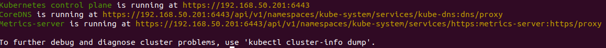
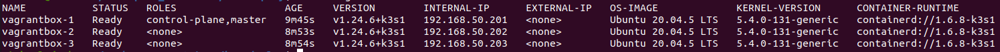

# k3s-deploy

Deploy a [K3S](https://k3s.io/) DEV cluster with [Ansible](https://docs.ansible.com/ansible/latest/index.html).

## Requirements

Copy and adapt `inventory/vagrantbox` or :

* Start some VM with [vagrantbox](https://github.com/mborne/vagrantbox#readme)
* Ensure that SSH connexion is working : `ansible -i inventory/vagrantbox all -m ping`

## Parameters

See [roles/k3s/defaults/main.yml](roles/k3s/defaults/main.yml).

## Usage

## Download external roles

```bash
ansible-galaxy install -r roles/requirements.yml
```

### Deploy K3S

```bash
# Deploy K3S with default params :
ansible-playbook -i inventory/vagrantbox playbooks/k3s.yml
# Deploy K3S with a docker mirror :
# ansible-playbook -i inventory/vagrantbox playbooks/k3s.yml -e k3s_docker_mirror=https://docker-mirror.quadtreeworld.net
```

### Configure kubectl

```bash
export KUBECONFIG=$PWD/.k3s/k3s.yaml
```

(See [roles/k3s/tasks/fetch-config.yml](roles/k3s/tasks/fetch-config.yml))

### Check kubectl config

* `kubectl cluster-info` :



* `kubectl get nodes -o wide` :



## Have fun with kubernetes!

* [kubernetes.io](https://kubernetes.io/)
* [container.training](https://container.training/)
* [mborne/docker-devbox](https://github.com/mborne/docker-devbox#readme)


## Uninstall K3S

```bash
# uninstall k3s on agent nodes
ansible -i inventory/vagrantbox k3s_agent -m shell -a "k3s-agent-uninstall.sh" --become
# uninstall k3s on master node
ansible -i inventory/vagrantbox k3s_master -m shell -a "k3s-uninstall.sh" --become
```

## License

[MIT](LICENSE)

## Notes

* Playbook is based on `curl -sfL https://get.k3s.io | sh -s -`.
* Playbook **is not intented to be used for production**
* Playbook is configured throw the following files :

  * [inventory/vagrantbox/group_vars/all/k3s.yml](inventory/vagrantbox/group_vars/all/k3s.yml)
  * [inventory/vagrantbox/group_vars/k3s_master/k3s.yml](inventory/vagrantbox/group_vars/k3s_master/k3s.yml)
  * [inventory/vagrantbox/group_vars/k3s_agent/k3s.yml](inventory/vagrantbox/group_vars/k3s_agent/k3s.yml)

* Traefik is disabled (`--disable traefik`) as it is a good exercise to understand its deployment under kubernetes (see [mborne/docker-devbox - traefik](https://github.com/mborne/docker-devbox/tree/master/traefik#traefik))

* `--flannel-iface=eth1` is important as `eth0` is NAT network created by vagrant (see [stackoverflow.com - Is there any way to bind K3s / flannel to another interface?](https://stackoverflow.com/questions/66449289/is-there-any-way-to-bind-k3s-flannel-to-another-interface/66495119#66495119))


