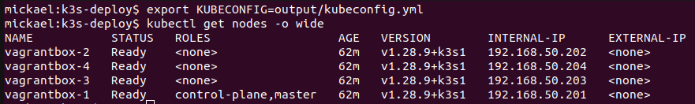

# k3s-deploy

Deploy a [K3S](https://k3s.io/) cluster with [Ansible](https://docs.ansible.com/ansible/latest/index.html).

## Motivation

Installing a single node K3S cluster is trivial (`curl -sfL https://get.k3s.io | sh -`). This repository aims at providing :

* A discovery cluster for [mborne/cours-devbox](https://github.com/mborne/cours-devops#readme) where vagrant and Ansible are presented before Kubernetes.
* A realistic multi-node cluster to illustrate monitoring and storage with Kubernetes (ReadWriteOnce, ReadWriteMany,...)

## Requirements

Copy and adapt `inventory/vagrantbox` or :

* Start some VM with [vagrantbox](https://github.com/mborne/vagrantbox#readme)
* Ensure that SSH connexion is working : `ansible -i inventory/vagrantbox all -m ping`

## Parameters

See [roles/k3s/defaults/main.yml](roles/k3s/defaults/main.yml).

## Usage

### Deploy K3S

```bash
# Deploy K3S with default params :
ansible-playbook -i inventory/vagrantbox playbooks/k3s.yml

# Deploy K3S using a DockerHub mirror
ansible-playbook -i inventory/vagrantbox playbooks/k3s.yml \
  -e k3s_docker_mirror=https://docker-mirror.quadtreeworld.net
```

### Configure kubectl

```bash
# In k3s-deploy directory :
export KUBECONFIG=$PWD/output/kubeconfig.yml
# List nodes
kubectl get nodes
```

> See [roles/k3s/tasks/fetch-config.yml](roles/k3s/tasks/fetch-config.yml)

### Check kubectl config

* `kubectl cluster-info` :


* `kubectl get nodes -o wide` :



## Have fun with kubernetes!

* [kubernetes.io](https://kubernetes.io/)
* [container.training](https://container.training/)
* [mborne/docker-devbox](https://github.com/mborne/docker-devbox#readme)

## Uninstall K3S

```bash
# uninstall k3s on agent nodes
ansible -i inventory/vagrantbox k3s_agent -m shell -a "k3s-agent-uninstall.sh" --become
# uninstall k3s on master node
ansible -i inventory/vagrantbox k3s_master -m shell -a "k3s-uninstall.sh" --become
```

## Advanced usage

### More install options...

See [roles/k3s/README.md](roles/k3s/README.md) :

```bash
# Deploying K3S with :
# - custom parent network for flannel (eth1 with KVM and generic/ubuntu2204)
# - custom kubernetes version
ansible-playbook -i inventory/vagrantbox playbooks/k3s.yml \
  -e k3s_docker_mirror=https://docker-mirror.quadtreeworld.net \
  -e k3s_flannel_iface=eth1 \
  -e k3s_channel=v1.30
```

### Installing NFS server on master node


```bash
# Download https://github.com/mborne/ansible-nfs-server role
ansible-galaxy install -r roles/requirements.yml

# Install NFS on vagrantbox-1
ansible-playbook -i inventory/vagrantbox playbooks/nfs-server.yml
# Check from vagrantbox-2
ssh vagrant@vagrantbox-2 showmount -e vagrantbox-1
```

### Enabling OIDC on K3S

See sample config [inventory/vagrantbox/group_vars/k3s_master/k3s-oidc.yml.dist](inventory/vagrantbox/group_vars/k3s_master/k3s-oidc.yml.dist) and [docs/oidc.md - K3S - OIDC experimentation with Keycloak](docs/oidc.md)

## Alternatives

Using [Kubernetes in docker (Kind)](https://kind.sigs.k8s.io/docs/user/quick-start/) also allows to create a realistic multi-node cluster (see [mborne/docker-devbox - kind - quickstart.sh](https://github.com/mborne/docker-devbox/tree/master/kind#readme))

## License

[MIT](LICENSE)


