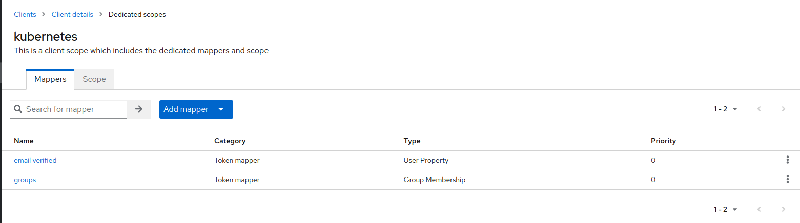
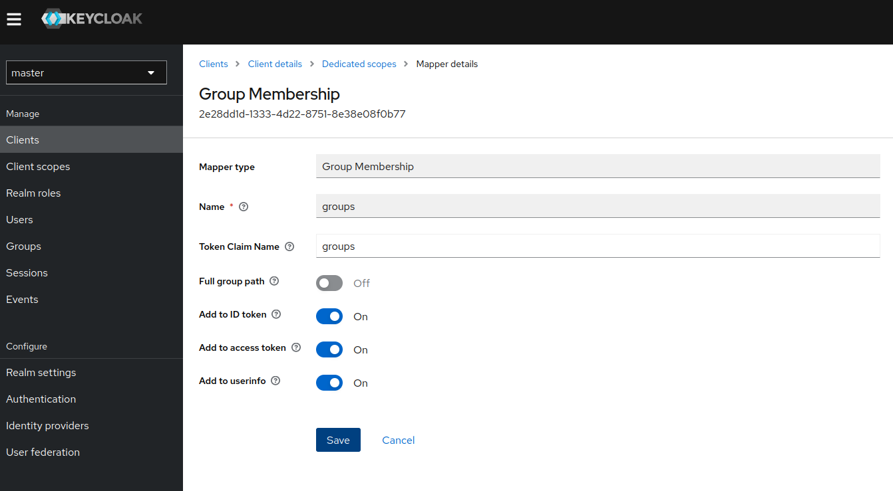
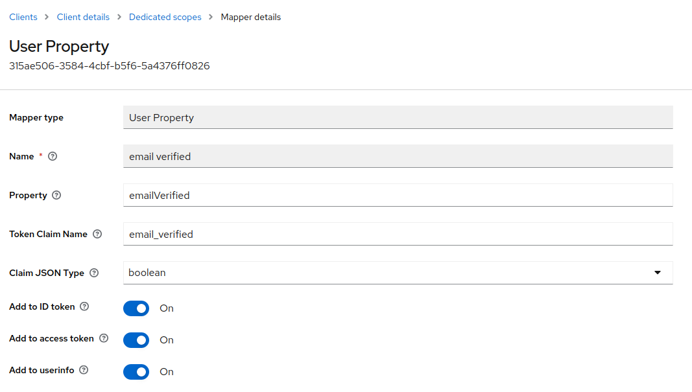

# K3S - OIDC authentification with Keycloak

## Configure keycloak

* Create a "kubernetes" client
* Add "groups" property for this client "Client Scopes / kubernetes-dedicated" :




* Ensure email verified is available



## Configure K3S to enable OIDC

See [inventory/vagrantbox/group_vars/k3s_master/k3s-oidc.yml.dist](../inventory/vagrantbox/group_vars/k3s_master/k3s-oidc.yml.dist) :

```bash
--kube-apiserver-arg oidc-issuer-url=https://keycloak.quadtreeworld.net/realms/master
--kube-apiserver-arg oidc-client-id=kubernetes
--kube-apiserver-arg oidc-groups-claim=groups
--kube-apiserver-arg oidc-groups-prefix=oidc:
--kube-apiserver-arg oidc-username-claim=email
--kube-apiserver-arg oidc-username-prefix=oidc:
```

## Configure RBAC

See [rbac/kustomization.yml](rbac/kustomization.yml) :

```bash
# bind oidc:k8s_admin group to "cluster-admin" role
kubectl create clusterrolebinding oidc-cluster-admin --clusterrole=cluster-admin --group='oidc:k8s_admins'

# bind oidc:k8s_users group to "view" role
kubectl create clusterrolebinding oidc-cluster-user --clusterrole=view --group='oidc:k8s_users'
```

## Configure kubectl

```bash
# install oidc-login plugin
kubectl krew install oidc-login

# configurer oidc-login
kubectl oidc-login setup \
  --oidc-issuer-url=https://keycloak.quadtreeworld.net/realms/master \
  --oidc-client-id=kubernetes \
  --oidc-client-secret=SecretFromKeycloak

# login in browser and follow instructions...
```

## Ressources

* [kubernetes.io - Authenticating - Configuring the API Server](https://kubernetes.io/docs/reference/access-authn-authz/authentication/#configuring-the-api-server)

```bash
--oidc-issuer-url=https://keycloak.quadtreeworld.net/realms/master
--oidc-client-id=kubernetes
--oidc-groups-claim=groups
# ...
```

* [docs.k3s.io - Customized Flags for Kubernetes Processes](https://docs.k3s.io/reference/server-config#customized-flags-for-kubernetes-processes)

> `--kube-apiserver-arg`

* [github.com - int128/kubelogin](https://github.com/int128/kubelogin)

* Pour le debug, ajouter un `-v1` à l'utilisateur "oidc" dans KUBECONFIG :

```yaml
- name: oidc
  user:
    exec:
      apiVersion: client.authentication.k8s.io/v1beta1
      args:
      - oidc-login
      - get-token
      - --oidc-issuer-url=https://keycloak.quadtreeworld.net/realms/master
      - --oidc-client-id=kubernetes
      - --oidc-client-secret=**********
      - -v1
      command: kubectl
      env: null
      provideClusterInfo: false
```
